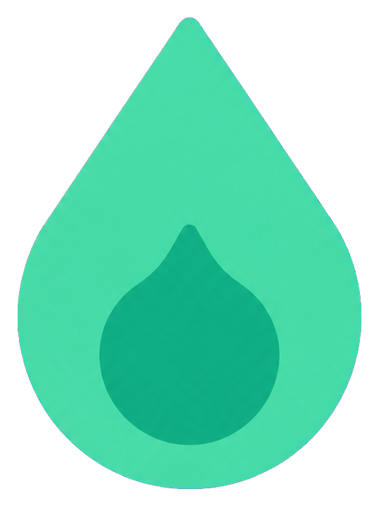

<p align="center">
  
</p>

# Car Fuel Live

[](https://github.com/jantrw/car-fuel-live/actions/workflows/ci.yml)

Car Fuel Live is a public web app for finding current fuel prices near a manually selected place in Germany and nearby European countries. It requires no account. Location search uses the project's PostgreSQL dataset, while the backend retrieves live prices from Tankerkoenig.

## What it does

- Searches countries, places, regions, and German postal codes after an explicit user action.
- Loads nearby E5, E10, and diesel prices for a selected place or postal code.
- Supports German and English.
- Stores only the selected country in the browser, never raw coordinates.

## Requirements

- Java 21
- Node.js `^20.19.0` or `>=22.12.0`
- Docker with Docker Compose
- PowerShell
- A Tankerkoenig API key for live fuel prices

## Run locally

1. Create the backend environment file:

   ```powershell
   Copy-Item .\car-fuel-live-backend\.env.example .\car-fuel-live-backend\.env
   ```

   Set `DB_USER`, `DB_PASSWORD`, and `DB_NAME` in the new file.

2. Start PostgreSQL from the repository root:

   ```powershell
   docker compose --env-file .\car-fuel-live-backend\.env -f .\car-fuel-live-backend\docker-compose.yml up -d
   ```

3. Start the backend in a new PowerShell terminal:

   ```powershell
   $env:TANKERKOENIG_API_KEY = '<your-api-key>'
   .\car-fuel-live-backend\gradlew.bat -p .\car-fuel-live-backend bootRun
   ```

4. After Flyway creates the schema, seed a new or empty database from another terminal:

   ```powershell
   .\car-fuel-live-backend\scripts\import-location-data.ps1
   ```

5. Install the frontend dependencies and start the development server:

   ```powershell
   npm --prefix .\car-fuel-live-frontend ci
   npm --prefix .\car-fuel-live-frontend run dev
   ```

   Open `http://localhost:5173`.

## Architecture

| Component       | Responsibility                                                                    |
| --------------- | --------------------------------------------------------------------------------- |
| Vue 3 frontend  | Handles location search, country context, and station results.                    |
| Spring Boot API | Validates requests and keeps database and Tankerkoenig access behind the backend. |
| PostgreSQL 17   | Stores countries, places, aliases, and German postal codes for manual search.     |
| Tankerkoenig    | Supplies live fuel prices to the backend.                                         |

```text
.
|- car-fuel-live-frontend/   Vue frontend
|- car-fuel-live-backend/    Spring Boot backend
|- docs/                     Product and architecture docs
```

## Verification

```powershell
.\car-fuel-live-backend\gradlew.bat -p .\car-fuel-live-backend spotlessCheck
.\car-fuel-live-backend\gradlew.bat -p .\car-fuel-live-backend test
npm --prefix .\car-fuel-live-frontend run lint
npm --prefix .\car-fuel-live-frontend run test -- --run
npm --prefix .\car-fuel-live-frontend run build
```

CI also runs backend dependency checks and a high-severity production dependency audit for the frontend.

## Documentation

- Product behavior and requirements: [`docs/documentation.md`](docs/documentation.md)
- Implemented architecture: [`docs/architecture.md`](docs/architecture.md)
